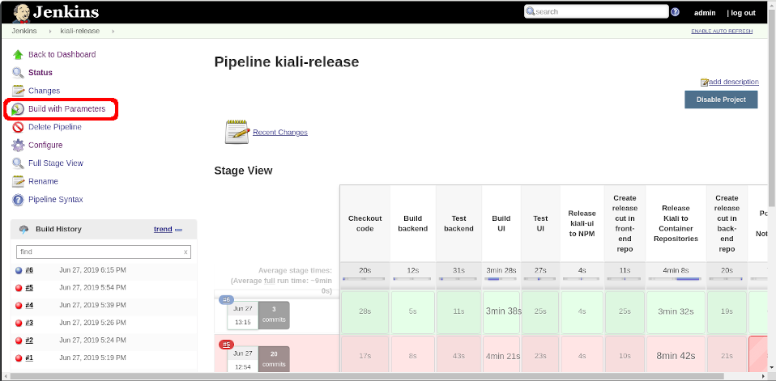
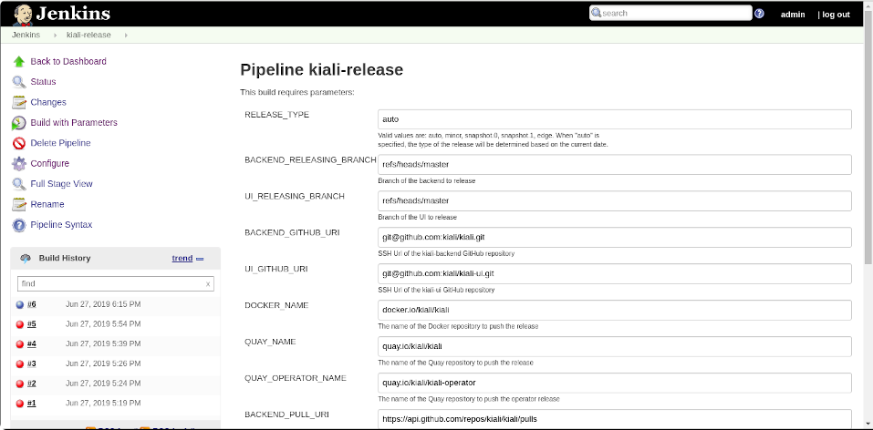
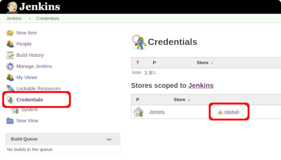
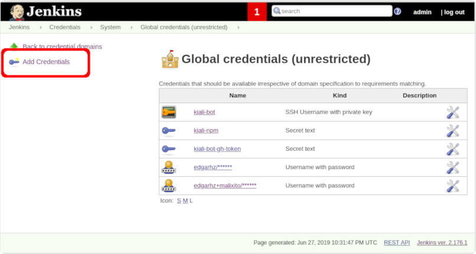
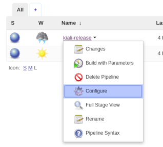
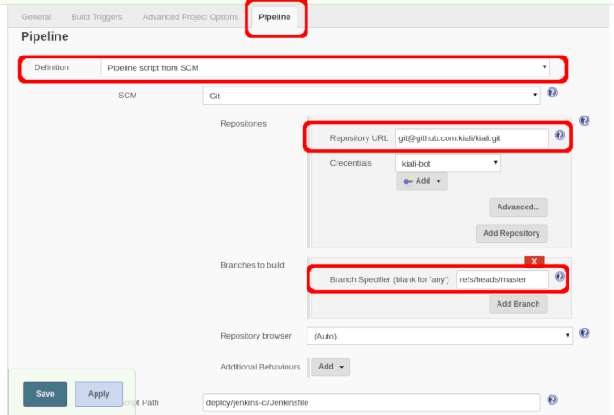

# Jenkins Pipeline

* [Directory contents](#directory-contents)
    + [The Pipeline](#the-pipeline)
    + [Support files](#support-files)
    + [Development helper files](#development-helper-files)
    + [README files](#readme-files)
* [Using the Pipeline](#using-the-pipeline)
    + [Automatically determine the release type and build it](#automatically-determine-the-release-type-and-build-it)
    + [Building a minor release](#building-a-minor-release)
    + [Building a patch release](#building-a-patch-release)
    + [Building a patch release (back-end only)](#building-a-patch-release-back-end-only)
    + [Building a major release](#building-a-major-release)
    + [Building a snapshot release](#building-a-snapshot-release)
    + [Building an edge/daily release](#building-an-edgedaily-release)
* [Recovering and troubleshooting a build](#recovering-and-troubleshooting-a-build)
* [Making test builds](#making-test-builds)
* [Developer setup](#developer-setup)
    + [Building the Jenkins image](#building-the-jenkins-image)
    + [Setup Jenkins credentials](#setup-jenkins-credentials)
    + [Re-configure the Pipeline](#re-configure-the-pipeline)

## Directory contents

This directory contains the main Jenkins Pipeline used to release
the Kiali project, support files used by the Pipeline during
building, and support files to ease the development of the
Pipeline.

### The Pipeline

The [Jenkinsfile](Jenkinsfile) is the main Kiali Pipeline. Learn
more in _[The Pipelines](#the-pipelines)_ section

### Support files

The `kiali-release` pipeline uses some support files:

* The [bin/determine-release-type.sh](bin/determine-release-type.sh)
  is used to automatically resolve what kind of release needs to be
  build, assuming the Pipeline runs weekly. Read the script
  to learn more about how it works.
* The [bin/jq](https://stedolan.github.io/jq/) v1.6 and
  [bin/semver](https://github.com/fsaintjacques/semver-tool) v2.1.0
  are tools used to properly set version strings when building releases.
* The [Makefile](Makefile) is repeatedly invoked by the Pipeline. It's
  analog and compliments the [Makefile.jenkins](https://github.com/kiali/kiali-ui/blob/master/Makefile.jenkins)
  of the kiali-ui repository. These are the files where the build
  steps are implemented.

### Development helper files

These files:

* [bin/entrypoint.sh](bin/entrypoint.sh)
* [Dockerfile](Dockerfile)
* [jenkins_ref/*](jenkins_ref)

are provided to create a container that can be used to test
the Pipeline.

### README files

The [README.md](README.md) file is what you are reading. The files
under the `assets` directory are used in the [README.md](README.md).

## The Pipelines

Kiali uses several pipelines to release the several Kiali artifacts. These
are their names:

* `kiali-release` is the main Pipeline used to release Kiali. It
  contains the script to release the back-end and the front-end, and to build
  and publish a container image to registry. It's [Jenkinsfile](Jenkinsfile)
  is located in the kiali/kiai repository.
* `kiali-operator-release` is the Pipeline that releases the operator. It's
  [Jenkinsfile](https://github.com/kiali/kiali-operator/blob/master/Jenkinsfile)
  is located in the kiali/kiai-operator repository.
* `kiali-helm-release` is the Pipeline that releases the Helm charts. It's
  [Jenkinsfile](https://github.com/kiali/helm-charts/blob/master/Jenkinsfile)
  is located in the kiali/helm-charts repository.
* `kiali-website-release` is the Pipeline that releases Kiali's website. It's
  [Jenkinsfile](https://github.com/kiali/kiali.io/blob/master/Jenkinsfile) is
  located in the kiali/kiali.io repository.

All Pipelines are written using [Jenkins's scripted syntax](https://jenkins.io/doc/book/pipeline/syntax/#scripted-pipeline)
which is very similar to the [Groovy language](https://groovy-lang.org/).

The `kiali-release` Pipeline is the main one. It invokes the other Pipelines
and is one you should run most of the time. You can run the others if you need
to do a release of the individual components.

Most of this README is focused on the `kiali-release` Pipeline. However, what
you read here can also be applied to the other pipelines.

## Using the main Kiali Pipeline

To run the Pipeline, open the _kiali-release_ job by clicking on it.
On the job page, click the _Build with Parameters_ option of the
menu at the left:



A new page asking for Pipeline parameters will appear:



All parameters have default values and you can run the Pipeline with
these defaults. If needed, change any parameter you need. Then, push
the _Build_ button at the end of the form to run the Pipeline.

As you can see, running the Pipeline is straightforward. The parameters
have a short description to help you know how to adjust them, if needed.

Since parameters are already described, instead of explaining what
each parameter does, the rest of this section is focused on showing
_by example_ how to run a build of the different Kiali use-cases. 
Unless pointed, it's assumed that you want build all artifacts (back-end,
front-end, operator, helm charts and website)

### Automatically determine the release type and build it 

This is achieved by using the default parameter values of the Pipeline. So,
don't worry about the parameters, just click _Build_.

In this mode, the Pipeline will use the date of the system to automatically
determine whether to build a **snapshot**, or to build a **minor** release.
In the current workflow of the project, the _Agile Sprints_ are used to
determine what kind of release to build.

The following image shows what kind of release is chosen to build, given the
current date and the Kiali's Sprint start/end cycle:


 
### Building a minor release

Set the RELEASE_TYPE parameter of the Pipeline to _minor_ value. This
will publish a minor release of Kiali from _master_ branches.


**Note:** Remember that minor releases are usually built automatically.

### Building a patch release

First, make sure that all fixes are properly committed to the
repositories (don't change version numbers).

In the current Kiali project workflow, patch releases are built off
from a version branch rather than the `master` branch. Set the Pipeline
parameters as follows:

* RELEASE_TYPE: Use `patch`.
* RELEASING_BRANCHES: The branch name of the repositories to
  generate the release from; e.g. `refs/heads/v0.20`. The build
  assumes that all repositories have a branch with this name.

Note that the Helm release always builds and pushes to the "master" branch
because that is the branch that GitHub Pages gets the content for the Helm
Chart Repository HTTP server.

### Building a patch release omitting the front-end

First, make sure that all fixes are properly committed to the
back-end repository (don't change version numbers).

In the current Kiali project workflow, patch releases are built off
from a version branch rather than the `master` branch.

Set the Pipeline parameters as follows:

* RELEASE_TYPE: Use `patch`.
* RELEASING_BRANCHES: The branch name of the repositories to
  generate the release from; e.g. `refs/heads/v0.20`. The build
  assumes that all repositories have a branch with this name.
* SKIP_UI_RELEASE: Set to `y`.

The front-end that will be bundled in the container image will be the version
specified in the main Makefile
(e.g: https://github.com/kiali/kiali/blob/v0.20.0/Makefile#L16). The front-end
will be downloaded from the NPM registry. If you want to bundle a different
front-end version, use the UI_VERSION parameter; for example.

* UI_VERSION: `0.19.0`

### Building a major release

In the current Kiali project workflow, major releases are built off
from a version branch rather than the `master` branch (similar to patch
releases). Make sure that all code to release is properly committed to the
repositories.

Version numbers must also be pre-setted in the code/version branches.
Example commits of a preparation for a previous major release:

* For the back-end: https://github.com/kiali/kiali/commit/793a577ce6829c62fc8b3c740a42896845c32481#diff-b67911656ef5d18c4ae36cb6741b7965
* For the front-end: https://github.com/kiali/kiali-ui/commit/df41a7077150c242c471c2b3dc2c9d3ec405fb4b#diff-b9cfc7f2cdf78a7f4b91a753d10865a2

Then, run Pipeline with the parameters as follows:

* RELEASE_TYPE: Use `major`.
* RELEASING_BRANCHES: The branch name of the repositories to
  generate the release from; e.g. `refs/heads/v1.0`. The build
  assumes that all repositories have a branch with this name.

Note that the Helm release always builds and pushes to the "master" branch
because that is the branch that GitHub Pages gets the content for the Helm
Chart Repository HTTP server.

### Building a snapshot release

Set the RELEASE_TYPE parameter of the Pipeline to _snapshot.X_ value, where
`X` is a number; e.g. `snapshot.7`. This will publish a snapshot release of
Kiali from the _master_ branches of the back-end and front-end.

**Note:** Remember that `snapshot.0` and `snapshot.1` releases are built
automatically. Use these ones if the automatic snapshot build failed.
Otherwise, you probably want to use a number greater than `1`.

### Building an edge/daily release

Set the RELEASE_TYPE parameter of the Pipeline to _edge_ value. This will
publish a release of Kiali with `latest` tags from the _master_ branches
of the back-end and front-end and operator.

**Note:** Remember that edge releases are build automatically on each
commit in the master branches of both the back-end and front-end
repositories.

### Omitting artifacts

There is a set of _SKIP\_*\_RELEASE_ parameters that allow individual control
about what should and should not be built:

* SKIP_BACKEND_RELEASE: Forces to omit the back-end build.
* SKIP_UI_RELEASE: Forces to omit the front-end build.
* SKIP_OPERATOR_RELEASE: Forces to omit the operator build.
* SKIP_HELM_RELEASE: Forces to omit the helm charts build.
* SKIP_SITE_RELEASE: Forces to omit the website build.

Note that, although you can force to omit the build of a component, you cannot
force building a component. Depending on the release type, some components can
be anyway omitted; e.g. `edge` releases won't release the website.

Note that, although you can use the `kiali-release` pipeline to build
individual components, there are dedicated pipelines for the operator,
the helm charts and the website. If you want to build only one of these
mentioned components, it's probably better to use the dedicated
pipeline of the component - it will be slightly faster.

## Recovering and troubleshooting a build

The Pipeline is not idempotent, mainly because of all external systems
that are involved (NPM, repositories, Quay.io, etc.). Nevertheless,
it is possible to re-try a build or do a new build to continue the
failed one. You first need to figure out at what stage the build failed
to decide how to proceed.

Before re-trying anything, check the logs of the failed build. If the
failure was caused by a network issue, you may retry it. Else, most likely
something needs to be fixed manually (code, tests, credentials, etc.).
Fix the cause of the failure and proceed to recover the build.

For `edge` releases, you can just retry the build. For other kind of releases,
first check if the `kiali-release` pipeline finished successfully. If it
didn't, pass through the following checks (in order) to know how to proceed
to recover the build. Do the suggested action of the first check that is not OK:

1. Is the front-end release properly
   [published in NPM](https://www.npmjs.com/package/@kiali/kiali-ui?activeTab=versions)?
   If not:
   * Retry the build. No special handling required.
1. Is the front-end version properly tagged in the repository?
   (see https://github.com/kiali/kiali-ui/tags). If not:
   * Manually create the tag setting the version in package.json
     to the published one.
   * For builds other than snapshots, manually update the package.json file 
     of the master/version branch to prepare it for the next release.
   * Retry the build but set parameters SKIP_UI_RELEASE to `y` and UI_VERSION
     to the version of the front-end that got published in NPM.
1. In the front-end repository, is the package.json correctly updated and
   prepared for the next version? If not:
   * This check does not apply for snapshot builds.
   * Manually update the package.json file of the master/version branch to
     prepare it for the next release.
   * Retry the build but set parameters SKIP_UI_RELEASE to `y` and UI_VERSION
     to the version of the front-end that got published in NPM.
1. Are the container images present in Quay.io?
   Is the back-end version properly tagged (see https://github.com/kiali/kiali/tags)?
   If not to any of these questions:
   * Retry the build but set parameters SKIP_UI_RELEASE to `y` and UI_VERSION
     to the version of the front-end that got published in NPM.
1. Is the back-end release properly created in https://github.com/kiali/kiali/releases?
   * Don't retry the build. 
   * Manually [create the version entry in GitHub](https://github.com/kiali/kiali/releases/new).
   * For builds other than snapshots, manually update the Makefile of
     the back-end repository to prepare it for the next version.
1. In the back-end repository, is the Makefile correctly updated and
   prepared for the next version? If not:
   * For snapshot releases this check doesn't apply.
   * Don't retry the build. Just update the Makefile manually.
1. If all previous checks are OK, then the build failed at a post-build stage.
   Most likely, you don't need to re-run the `kiali-release` pipeline, but other
   pipelines may need to be run again. 
   
If the `kiali-release` pipeline looks good, then check the other pipelines:
`kiali-oerator-release`, `kiali-helm-release` and `kiali-website-release`.
If any of these failed, you need to check first if the associated repository
was affected. If it wasn't affected, you should be able to, simply, re-run
the pipeline to retry. If it was affected, you will need to fix the build
manually.
   
## Making test builds

It is not possible to simulate a build. However, you can run a build
against and affecting alternate repositories.

To run test builds you will need your own forks of the Kiali repositories
and your own Quay.io repository. You will need to
setup Jenkins with a GitHub and Quay.io accounts with push
privileges to your repositories; see the
[Setup Jenkins credentials](#setup-jenkins-credentials) of the developer
setup section to learn more.

When running the build, set the following parameters:

* BACKEND_REPO: Use your Kiali's back-end fork (in owner/repo format); e.g.
  `israel-hdez/swscore`.
* UI_REPO: Use your Kiali's front-end fork (in owner/repo format); e.g.
  `israel-hdez/swsui`.
* OPERATOR_REPO: Use your Kiali operator fork (in owner/repo format); e.g.
  `israel-hdez/kiali-operator`.
* HELM_REPO: Use your Kiali helm-charts fork (in owner/repo format); e.g.
  `israel-hdez/helm-charts`.
* QUAY_NAME: Use your own Quay.io repository for Kiali;
  e.g. `quay.io/edgarhz/kiali`.
* QUAY_OPERATOR_NAME: Use your own Quay.io repository for the operator;
  e.g. `quay.io/edgarhz/kiali-operator`.
* NPM_DRY_RUN: Set to `y`.

Once you run the first test build, if you need to run more test builds,
you may want to use the _Rebuild_ option to avoid setting these
parameters again.

Take into account that the Pipeline can create tags, branches, and commits
on your repositories. Make sure to reset your forks if you are using them
for developing/contributing to Kiali.

## Developer setup

Modifying the Pipeline is easy. You just need a text editor :smile:.
See the [Directory contents](#directory-contents) section to have
some understanding about which files you need to change.

The "hard" part is to test the Pipeline. You need a Jenkins instance
with the tools to correctly build both Kiali's back-end and
front-end and operator, and to deploy Kiali. Instead of going through all the
steps to setup such Jenkins instance, a  [Dockerfile](Dockerfile) is provided
to let you build a preconfigured container image. All required files
are provided in the [/deploy/jenkins-ci](/deploy/jenkins-ci)
directory of the repository. Inside that directory, simply run:

`docker build -t kiali-jenkins .`

And run the generated image:

```bash
docker run \
  -v /var/run/docker.sock:/var/run/docker.sock \
  -p 8080:8080 \
  kiali-jenkins
```

Check the [Dockerfile](Dockerfile) to learn how Jenkins is set up.

This command assumes that your Docker daemon's socket is in
`/var/run/docker.sock`. The `-v` parameter is needed because
Kiali is released as a container image, which means that Jenkins
needs access to Docker to build and push the container. Using the
provided command, Jenkins will re-use the Docker instance of
your machine.

Once the container is running, use your browser to access Jenkins
at http://localhost:8080. Username and password are both `admin`.

The image is preconfigured with all pipelines mentioned in
_[The Pipelines](#the-pipelines)_ section. There is also an additional
pipeline named `kiali-release-notifier` which does nothing. It's there because
it's invoked by other jobs. In the real setup, it does some QE tasks.

### Setup Jenkins credentials

The only thing that is not setup in the preconfigured Jenkins
image are _credentials_. I hope you can guess why :smile:.

Before trying anything, you need to properly setup the credentials.
You can either manually setup the credentials using the Jenkins UI,
or you can pass some environment variables when running the docker
image and credentials will be setup for you.

If you prefer setting up the credentials via the Jenkins UI, login into
Jenkins, click _Credentials_ in the menu at the left, then click _(global)_
in the page that appears:



In the _Global credentials_ page, use the _Add Credentials_ option
at the left to add these five credentials:

* **GitHub SSH keys of the "bot" account**: Used to checkout
  the code to be built, and also to push tags and branches to the
  repositories. For development, you can use an [SSH key
  associated with your GitHub account](https://github.com/settings/keys)
  (it will be safer if you have an account without
  privileges to push to the Kiali repositories.)
  * Kind: SSH Username with private key
  * ID: kiali-bot-gh-ssh
  * Username: whatever you want
  * Private key: A valid SSH private key for GitHub
* **GitHub token of the "bot" account**: Used to make calls to
  the [GitHub REST API](https://developer.github.com/v3/). For
  development, you can use a [GitHub Personal access token](https://github.com/settings/tokens).
  This token and the SSH keys of the previous bullet should
  be associated to the same GitHub account. 
  * Kind: Secret text
  * ID: kiali-bot-gh-token
  * Secret: A valid GitHub token
* **NPM token**: This is already pre-configured with a random string.
* **Quay credentials:** Used to push the Kiali image and the
  Kiali operator image to Quay.io. For development, use your
  Quay.io account (it will be safer if you use an account
  without push rights to the Quay Kiali repositories.)
  * Kind: Username with password
  * ID: kiali-quay
  * Username: A valid Quay.io username
  * Password: A valid Quay.io password
  
If you prefer to configure via environment variables, this is how you do the
equivalent configuration:

```bash
export BOT_TOKEN=your_github_personal_access_token
export QUAY_USERNAME=your_quay_username
export QUAY_PASSWORD=your_quay_password
export BOT_SSH_KEY="$(cat your_ssh_private_key_file)"
docker run \
  -v /var/run/docker.sock:/var/run/docker.sock \
  -p 8080:8080 \
  -e BOT_TOKEN \
  -e QUAY_USERNAME \
  -e QUAY_PASSWORD \
  -e BOT_SSH_KEY \
  kiali-jenkins
```

Once you finish setting up credentials, the list should look similar
to the following image and you are ready to start builds:



Please, read the [Making test builds](#making-test-builds) section
before running your first build.

### Re-configure the Pipeline

This step is optional. The preconfigured job will fetch and use the
[Jenkinsfile](Jenkinsfile) from the `master` branch of the Kiali
back-end repository. So, if you are going to change the
[Jenkinsfile](Jenkinsfile), you need to change this configuration.
Else, skip this section.

On the Jenkins home page, place your mouse pointer over the
_kiali-release_ job. Press the little arrow that appears next to
the job name and select _Configure_ in the menu:



In the configuration page, select the _Pipeline_ tab to scroll
down to see the form to change:



You have two options to re-configure:

1. You can change the _Definition_ dropdown to _Pipeline script_ .
   The form will be replaced with an editor. Just paste the edited
   _Jenkinsfile_. Then, save the Pipeline and trigger a build to test
   your changes.
1. Change the _Repository URL_ and the _Branch Specifier_ to
   point to the place where you are pushing your changes. Then,
   save the Pipeline and trigger a build to test your changes.
   
First option is better if you are only changing the [Jenkinsfile](Jenkinsfile).
If you also need to change other support files, you can use either.

If you need, you can do a similar re-configuration to the other
[pipelines](#the-pipelines).