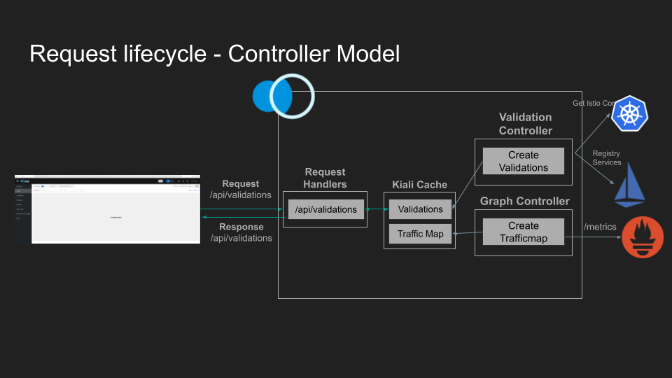

# Kiali Controller Model

1. [Summary](#summary)
2. [Motivation](#motivation)
   1. [Goals](#goals)
   2. [Non-Goals](#nongoals)
3. [Solution](#solution)
   1. [Other solutions](#othersolutions)
4. [Roadmap](#roadmap)

# Summary

Improve response times of the Kiali API by moving time consuming operations out of a request's lifecycle. Implement various "controllers" that handle these time consuming operations, usually by reading from the Kubernetes cache and writing to the Kiali cache.

# Motivation

Kiali currently has acceptable performance below a certain threshold of scale. That "scale" could be number of pods, services, Istio resources, namespaces, etc. but in general Kiali reaches a certain threshold of one or more of these factors and it becomes noticeably slow. Typically this manifests itself in very long page load times (30s+) and very slow (30s+) API responses. Kiali should remain performant even at larger scale.

Notably, Kiali does most processing within the lifecyle of a request. This means that before the API responds to a request, it fetches data from external dependencies (e.g. prometheus, jaeger), performs some processing (graph generation, validations), and then transforms the results into an API response. If any one of those tasks performs poorly, or fails entirely, the response can be extremely slow or fail altogether.

## Goals

- Improve Kiali performance (page/element load times) at larger scales.
- Make Kiali more resilient to transient failures.

## Non-goals

- Frontend optimizations.
- API changes (pagination).
- Add external storage requirement (database).
- Implement a custom controller framework.

# Solution

A "Kiali model" has been [previously discussed](https://github.com/kiali/kiali/discussions/4080), and is an in-memory, pre-computed cache of data for things like Validations, Health, and TLS. Kiali would compute this data outside of a request and then cache it for some period of time. This KEP expands on that idea by providing a specific framework for how to compute and cache that data. This framework is henceforth called the "controller model" and it follows the same pattern as most Kube controllers.

A typical Kubernetes controller continually watches some objects for changes, and when an object does change, it reads the current state, does some work to get things to the desired state, then updates the status of the object. For example, a deployment controller might watch for deployments to be created and on creation the deployment controller: reads the deployment spec --> creates pods according to the spec --> updates the deployment status with the pods it created. When someone reads that deployment from the Kube API server, the API server does not compute the deployment status, it simply serves up what is saved in etcd.

This proposes that Kiali follow a similar pattern and have different controllers to compute and cache in memory the data that the Kiali API returns. These controllers will run in the same binary as Kiali and there won't be any additional deployment requirements. Each controller can read/watch from one or more sources, such as `VirtualService` objects from the kube API, or data outside of Kube like proxy status for workload `Health`. After gathering the inputs, the controllers would compute something like Validations and then update the Kiali Cache.

Using Validations as an example, here's a diagram of what this process will look like:



The controller watches each source and when one changes, it validates the object, and then updates the Kiali Cache with the validation. When the frontend asks for validations, the API reads what is in the Kiali Cache. Because validations are served directly from memory rather than computed on the fly, the API response times are very fast and remain that way even as the number of objects grows.

An advantage to building controllers using the controller model, is being able to re-use Kubernetes libraries and patterns to handle setting up watches, parallel process, retry on failures, etc. Most of the sources will come from Kubernetes. Non-Kubernetes sources can be implemented with Polling if they do not have some kind of "watch" mechanism. Kubernetes sources will be updated almost instantaneously, making this a "near real time" solution. Non-Kubernetes sources will be limited by how often they poll the source but probably not more than 15-30s. This amount of lag is acceptable for Kiali's use cases and is a reasonable trade-off for better performance.

There are a few downsides to this approach:

1. Caching more objects in memory will require greater memory usage. The Kiali cache is an in-memory cache and storing more objects in memory will lead to an increase in memory consumption. This can be mitigated somewhat by only storing the results of computations in the Kiali cache, for example storing a graph traffic-map rather than all of the individual metrics used in its generation. There are also some optimizations to be made by reducing the amount of memory consumed by the Kubernetes cache that Kiali uses: https://github.com/kiali/kiali/issues/7017. This could offset increased memory consumption by the Kiali cache. Ultimately though there's no free lunch and storing more objects in memory will require more memory. Kiali will need to keep the size of this cache reasonably small.

   It's possible Kiali could read from/write to disk rather than memory but this might negate performance gains.

   We also don't want to require an external store for Kiali. One of the advantages of Kiali is how simple it is to deploy. It requires no external dependencies beyond what you already have when you deploy istio (kubernetes, istio, prometheus). Adding an additional infrastructure dependency to Kiali will be an operational burden.

2. Kubernetes controller tooling assumes you're working with Kubernetes objects. Controllers in Kiali will partially be working with Kubernetes objects but may also want to reconcile non-kubernetes objects. For example, the Mesh model for the Kiali cache is used in many places:

   ```
   // Mesh is one or more controlplanes (primaries) managing a dataplane across one or more clusters.
   // There can be multiple primaries on a single cluster when istio revisions are used. A single
   // primary can also manage multiple clusters (primary-remote deployment).
   type Mesh struct {
      // ControlPlanes that share the same mesh ID.
      ControlPlanes []ControlPlane
   }
   ```

   This is not a Kubernetes object but other controllers will probably want to know when this mesh model changes and reconcile their models when it does. This is doable with the existing Kubernetes tooling (controller-runtime) but will probably require some hacks where a fake Kube object is passed to the event handlers and the Kiali cache rather than the controller-runtime client is used to fetch the object.

# Roadmap

- [ ] Accept KEP.
- [ ] Merge POC.
- [ ] Create controllers for existing endpoints that are known to take a long time such as mtls.
