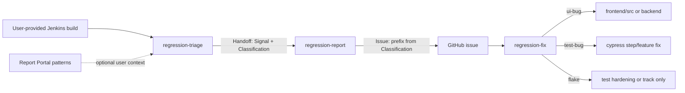

# Regression skills — classification vocabulary unification

Plan to align `regression-triage`, `regression-report`, and `regression-fix` on a single vocabulary. Track implementation in project TODO; close peer-review **INT-02** when done.

## Problem

Three overlapping terms are used today without a single contract:

| Term | Where it appears | Meaning today |
|------|------------------|---------------|
| Jenkins `REGRESSION` | Triage Step 2 (`testReport` API) | Test passed last run, failed now |
| Handoff `Classification` | Triage → report → fix | `flake` \| `ui-bug` \| `test-bug` (root cause / fix strategy) |
| Issue title `[Flake]` / `[Regression]` | `TODO.md`, some filed issues | User-facing bucket (not defined in skills) |

**Concrete bugs:**

- Triage Step 4 row “passes on `main`, fails on feature branch” is labeled **`ui-bug`**, but that pattern is a **regression signal**, not root cause (could be `ui-bug` or `test-bug`).
- Wording “**New** test, passes on `main`” is contradictory; likely meant “existing test / behavior passes on `main`”.
- Peer review ([regression-skills-peer-review.md](./regression-skills-peer-review.md) **INT-02**): triage implied a `regression` sub-type of `ui-bug`, but report has no `regression` label; issue #9725 mixed `[Flake]` title with `test-bug` body.

## Scope boundary — single build only

**Agents must not fetch or reason over Jenkins builds other than the one the user provided.**

| Allowed (user-provided build URL only) | **Disabled** (remove from all three skills) |
|----------------------------------------|---------------------------------------------|
| `testReport` for that build (`FAILED`, `REGRESSION` on cases) | Querying other build numbers / job history |
| Artifacts from that build (`kiali-pod.log`, screenshots, env snapshot) | “Intermittent across builds”, “passes on `main`”, branch-vs-main comparison |
| Build metadata from that build’s API (`ISTIO_VERSION` param, etc.) | Agent-side flake frequency counting (“2+ nightly failures in 7 days”) |
| User-supplied context (pasted log, Report Portal summary, explicit “I’ve seen this before”) | Inferring persistence by curling previous nightly URLs |

**Report Portal** (external) owns **repetitive / historical test patterns** (flake frequency, recurring failures, trends). Skills may **reference** Report Portal when the user pastes a link or summary, but agents do **not** duplicate that analysis via extra Jenkins API calls.

## Target model

Separate **how we detected** the failure from **what to fix**.

| Layer | Purpose | Allowed values |
|-------|---------|----------------|
| **Signal** (optional handoff field) | Detection context **from this build only** or user/Report Portal input | `jenkins-regression` (from this build’s `testReport`), `first-occurrence` (user or Report Portal) |
| **Classification** (required) | Root cause and fix routing | `flake` \| `ui-bug` \| `test-bug` |
| **Issue title prefix** | Scan-friendly GitHub title | Derived from classification (see mapping below) |

**Removed signals** (required other builds or agent-side history): `persistent`, `passes-main-fails-branch`, and any rubric row that depends on comparing to `main` or prior nightlies.

**Rule:** Do **not** add a fourth handoff value `regression` unless `regression-report` labels and `regression-fix` Step 4 strategies are updated in the same change. Prefer **signal** + existing three classifications.

**Rule:** Jenkins `REGRESSION` on a case in the **user-provided** build’s `testReport` is a **signal** (`jenkins-regression`), not a handoff `Classification`. It reflects Jenkins’ server-side comparison to the previous run; the agent does not fetch that previous build. Triage still assigns `flake` \| `ui-bug` \| `test-bug` from error shape and user/Report Portal context.

**Rule:** Flake vs persistent is **not** decided by agents polling Jenkins history. Use Report Portal (or the user) for recurrence; classify from the **current failure’s** error message, screenshot step, and scenario semantics.

## Recommended mapping

| Classification | Issue title prefix | GitHub labels (report) | Fix strategy (fix) |
|----------------|------------------|------------------------|-------------------|
| `flake` | `[Flake]` | `bug`, `maintenance` | `flake` branch (retries, timing, nested `it()`, etc.) |
| `ui-bug` | `[Regression]` | `bug` | `ui-bug` branch; product fix in `frontend/src/` or backend; **do not** weaken test assertions without product fix |
| `test-bug` | `[Test]` or `[Maintenance]` | `maintenance` | `test-bug` branch; update step defs / feature file |

Report label rules stay as today: `test-bug` does **not** get `bug`; `ui-bug` does **not** get `maintenance`.

## Triage rubric changes (Step 4)

Classify from **this build’s** failure data only (error text, failing step, screenshot filename). Do not curl other builds.

| Evidence (single build) | Suggested classification | Notes |
|-------------------------|-------------------------|-------|
| `TimeoutError`, element not found, typical timing/selector flake signatures | `flake` | Default when root cause unclear and user/Report Portal cites intermittent history |
| Assertion on wrong value/text, app shows wrong data, stable repro on retry in same run | `ui-bug` | Product state is wrong |
| `Cannot read properties of undefined`, bad selector, stale assertion | `test-bug` | Test/code mismatch |
| Case status `REGRESSION` in this build’s `testReport` | **Investigate** → `ui-bug` or `test-bug` | Record signal `jenkins-regression`; not auto `ui-bug` |
| Cause unclear after ruling out obvious `test-bug` | `ui-bug` (default) | Prefer product investigation over test-only workaround |

**Report Portal (optional):** If the user provides a Report Portal link or paste (e.g. “failed 5 of last 7 launches”), use it for **confidence** and filing recommendation only — not as a substitute for `Classification`.

## Implementation checklist

### 1. `regression-triage/SKILL.md`

- [ ] **Remove** user prompt “First failure or persistent?” (or replace with optional “Report Portal / recurrence note” — free text, no Jenkins history fetch).
- [ ] **Remove** rubric rows: “intermittent across builds”, “passes on `main` but not feature branch”, defaults tied to “reproducible/persistent” from multi-build inference.
- [ ] **Restrict** all `curl`/Jenkins access to the user-provided build URL only; document explicitly in Step 1.
- [ ] Add optional handoff field: `Signal: <value>` (`jenkins-regression` \| `first-occurrence` \| omit).
- [ ] Document Jenkins `REGRESSION` vs handoff `Classification` in Step 2 (same-build `testReport` only).
- [ ] **Remove** flake handoff policy “2+ occurrences in recent nightly” — point to Report Portal for recurrence; flakes still get a short note in triage output, not a separate Jenkins poll.
- [ ] Add link to this doc as canonical reference.
- [ ] Step 5 (`git log` / `gh issue` search): keep for **duplicate issues**, not for build-history pattern analysis.

### 2. `regression-report/SKILL.md`

- [ ] Enforce issue title prefix from classification table (align with `TODO.md`).
- [ ] Keep body `**Classification:**` as `flake` \| `ui-bug` \| `test-bug` only.
- [ ] Add optional `**Signal:**` line in issue template when triage provides it.
- [ ] Document: if title prefix and body classification disagree, **body wins** for fix agents.
- [ ] **Replace** “Do not file flake unless 2+ nightly failures in 7 days” with: file flakes when user requests **or** triage/Report Portal indicates recurrence; agents do **not** verify recurrence by fetching other Jenkins builds.
- [ ] Optional issue body field: `**Report Portal:** <url or summary>` when user provides it.

### 3. `regression-fix/SKILL.md`

- [ ] Step 1: parse `Classification` only (unchanged enum).
- [ ] Step 1: parse optional `Signal` and optional `Report Portal` when present.
- [ ] **Remove** any guidance to compare against `main` or prior Jenkins builds for classification.
- [ ] Step 3b (`git log` / `gh issue`): keep for prior **fixes and duplicate issues**, not for Jenkins build-pattern detection.
- [ ] Note: trust issue body `Classification` over title prefix when they conflict.
- [ ] Do not block fix work on agent-proven “persistent across nightlies”; rely on issue + Report Portal context from humans/triage.

### 4. `docs/regression-skills-peer-review.md`

- [ ] Close **INT-02** after skills match this plan.
- [ ] Update contract matrix with `Signal` column if added to handoff.
- [ ] Note Report Portal as external owner of cross-build pattern analysis (out of agent scope).

### 5. Single source of truth

- [ ] Either keep this file as canonical and link from all three skills, or move the mapping table into triage skill and link from report/fix.
- [ ] Acceptance: one table, no contradictory rows across triage / report / fix; no skill instructs fetching non-user builds.

## Handoff block (target shape)

```
## Handoff Block — Failure N

- Scenario: <exact scenario name>
- Feature file: frontend/cypress/integration/featureFiles/<file>.feature
- Tag(s): @<tag1>, @<tag2>
- Failing step: <Given/When/Then/And step text>
- Error: <error message, one line>
- Signal: <optional — jenkins-regression | first-occurrence>
- Classification: <flake | ui-bug | test-bug>
- Confidence: <high | medium | low>
- Report Portal: <optional — URL or one-line recurrence summary from user>
- Environment: Jenkins nightly | kind | …
- Build URL: <full build URL>
- Kiali version: <version>
- OCP version: <version>
- Istio version: <version or "not specified">
```

## Pipeline diagram (after unification)



## Related

- [regression-skills-peer-review.md](./regression-skills-peer-review.md) — INT-02, contract matrix
- [TODO.md](../TODO.md) — issue title prefixes `[Flake]` / `[Regression]`
- Skills: `.claude/skills/regression-triage/`, `regression-report/`, `regression-fix/`
