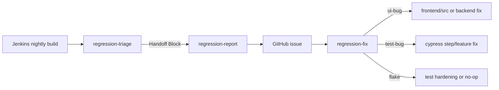

# Regression Skills Peer Review — 2026-05-25

## Executive summary

- **Overall verdict:** Approve with changes
- **Smoke build URL:** https://jenkins-csb-servicemesh-master.dno.corp.redhat.com/job/kiali/job/test-jobs/job/kiali-cypress-tests/5772/
- **Proxy issue URL (report+fix validation):** https://github.com/kiali/kiali/issues/9725
- **Cypress outcome:** Blocked — no local `kind` cluster or Kiali instance (`kind get clusters` empty; `curl localhost:20001` failed)

### Top 3 findings

1. **Blocker — Handoff field loss:** `Failing step` and `Confidence` are emitted by triage but dropped by report and not parsed by fix. Fix agents must re-derive the failing step from the scenario, wasting time and risking wrong step analysis.
2. **Major — Jenkins inaccessible without VPN:** Live triage smoke failed (`curl` HTTP 000). Skill documents no auth/VPN remediation when Step 1a fails.
3. **Major — Tag extraction is imprecise:** Triage `grep -B30` tag method returns tags from prior scenarios in the same feature file (verified on `graph_context_menu.feature`).

### Review team

| Role | Reviewer | Notes |
|------|----------|-------|
| A — Triage owner | Agent (static + attempted live) | Jenkins live fetch blocked |
| B — Issue owner | Agent | Validated against issue #9725 |
| C — Fix owner | Agent | Step trace complete; Cypress blocked |
| D — Integration lead | Agent | Consolidated this document |

---

## Pipeline diagram + contract matrix



### Contract matrix (filled)

| Field | Triage emits | Report consumes | Issue preserves | Fix parses |
|-------|:---:|:---:|:---:|:---:|
| Scenario | yes | yes | yes | yes |
| Feature file | yes | yes | yes | yes |
| Tag(s) | yes | yes | yes | yes |
| Failing step | yes | implicit only | **no** | **no** |
| Error | yes | yes | yes | partial (prose after Classification) |
| Classification | yes | yes | yes | yes |
| Confidence | yes | **no** | **no** | **no** |
| Environment | yes | yes | yes | yes (Environment section) |
| Build URL | yes | yes | yes | partial (Other field only) |
| Kiali version | yes | yes | yes | yes |
| OCP version | yes | yes | yes | yes |
| Istio version | yes | yes | yes | yes |

**Blocker gaps:** `Failing step`, `Confidence`

**Classification drift:** Triage defines `regression` as ui-bug sub-type; report has no `regression` label. Issue #9725 title uses `[Flake]` while body says `test-bug`.

---

## Findings by skill

### regression-triage (T1–T10)

| ID | Item | Result | Evidence |
|----|------|--------|----------|
| T1 | Build URL validation | **Pass** | Skill rejects job root; numeric segment required. Regex `/[0-9]+/?$` validates build URLs. |
| T2 | Jenkins accessibility | **Fail** | No VPN/auth guidance. Live `curl` returned HTTP 000 (DNS/network unreachable). |
| T3 | Artifact fetch commands | **Pass (unverified live)** | Paths match skill docs; could not fetch live due to T2. |
| T4 | Test report API | **Pass (unverified live)** | jq filter for FAILED/REGRESSION is structurally correct. |
| T5 | Scenario → feature mapping | **Pass** | `grep -rl "Inbound Metrics in context menu"` → `graph_context_menu.feature`. |
| T6 | Classification rubric | **Pass** | Covers flake/ui-bug/test-bug/regression with defaults. |
| T7 | Screenshot usage | **Fail** | Screenshots listed in 1b but never referenced in classification steps. |
| T8 | Known-issues lookup | **Pass** | `gh issue list --search` found #9725; `git log --grep` returned empty for sample. |
| T9 | Handoff block completeness | **Pass** | All 12 fields defined with extraction rules. |
| T10 | Flake policy | **Pass** | Flakes → frequency tracking; ui/test-bug → handoff to report. |

#### TRIAGE-01 — Jenkins auth/VPN not documented

- **Severity:** major
- **Location:** `.claude/skills/regression-triage/SKILL.md` Step 1a
- **Observation:** `curl` HTTP non-200 stops workflow with no remediation. Corp Jenkins (`jenkins-csb-servicemesh-master.dno.corp.redhat.com`) unreachable without VPN.
- **Impact:** Triage skill unusable for most contributors outside Red Hat network.
- **Recommendation:** Add Step 1a fallback: paste Jenkins console excerpt or `testReport` JSON export; document VPN requirement.

#### TRIAGE-02 — Tag extraction returns stale tags

- **Severity:** major
- **Location:** `.claude/skills/regression-triage/SKILL.md` Step 3
- **Observation:** `grep -B30 "<scenario>" … \| grep @` on `graph_context_menu.feature` returns duplicate tags from preceding scenarios (9 lines vs 3 expected).
- **Impact:** Wrong tags in handoff → wrong hooks fire during local repro (`@offline` matters).
- **Recommendation:** Replace with line-number grep: read lines between last `@` block before `Scenario:` and the scenario line, or use `gherkin-lint`/parse scenario block only.

#### TRIAGE-03 — Screenshots unused in classification

- **Severity:** minor
- **Location:** Step 1b vs Step 4
- **Observation:** Screenshot filenames encode failing step but skill never fetches or references them.
- **Impact:** Missed signal for classification (especially ui-bug vs test-bug).
- **Recommendation:** Add optional Step 4a: list screenshot filenames matching scenario name; extract failing step from filename.

---

### regression-report (R1–R8)

| ID | Item | Result | Evidence |
|----|------|--------|----------|
| R1 | Handoff parsing | **Pass** | Skill says use handoff without re-asking. |
| R2 | Field propagation | **Fail** | `Failing step`, `Confidence` absent from issue template. |
| R3 | Title format | **Fail** | Issue #9725 title `[Flake] … — graph_context_menu.feature` missing `/ Jenkins nightly` suffix and uses `[Flake]` not `[Test]`. |
| R4 | Labels | **Fail** | Issue #9725 has only `bug`; skill says test-bug → `maintenance`. |
| R5 | Reproduce command | **Pass** | `yarn cypress:run:selected` exists in `frontend/package.json`. |
| R6 | Environment notes | **Pass** | VPN, insecure API, Minikube notes align with `frontend/cypress/README.md`. |
| R7 | `gh issue create` | **Pass** | HEREDOC pattern and repo correct. |
| R8 | Flake filing policy | **Fail** | Triage defers flakes; report defines flake labels with no threshold rule. |

#### REPORT-01 — Handoff fields dropped from issue body

- **Severity:** blocker
- **Location:** `.claude/skills/regression-report/SKILL.md` Issue body template
- **Observation:** Handoff includes `Failing step` and `Confidence`; template omits both.
- **Impact:** Fix skill cannot narrow to failing step without re-tracing entire scenario.
- **Recommendation:** Add to template:
  ```markdown
  **Failing step:** `<step text>`
  **Confidence:** <high | medium | low>
  ```

#### REPORT-02 — Title/label inconsistency with skill spec

- **Severity:** major
- **Location:** Issue #9725 vs skill title/label rules
- **Observation:** Created issue uses `[Flake]` prefix, omits environment suffix, applies only `bug` label for test-bug classification.
- **Impact:** Issue queue hard to filter; classification ambiguous from title alone.
- **Recommendation:** Enforce title template strictly; add validation step before `gh issue create`. Map classification → labels exactly as table specifies.

#### REPORT-03 — Flake filing threshold undefined

- **Severity:** major
- **Location:** R8 / triage Step 6
- **Observation:** Triage says track flakes until 2+ occurrences; report skill always supports flake issue creation.
- **Impact:** Noise in issue tracker or under-reporting depending on agent interpretation.
- **Recommendation:** Add explicit rule: "Do not file flake issues until 2+ nightly failures in 7 days unless user requests."

---

### regression-fix (F1–F12)

| ID | Item | Result | Evidence |
|----|------|--------|----------|
| F1 | Issue parsing | **Pass** | Issue #9725 fields extractable via `gh issue view`. |
| F2 | Missing field handling | **Fail** | No parsing for `Failing step` or `Confidence`; not in issue body anyway. |
| F3 | Step tracing | **Pass** | Scenario steps map to `graph_context_menu.ts` lines 7–91. |
| F4 | Root-cause patterns | **Pass** | Nested `it()` confirmed in `mesh.ts` (3), `wizard_request_routing.ts` (4), `wizard_istio_config.ts` (1). |
| F5 | Fix strategies | **Pass** | flake/test-bug/ui-bug branches distinct; ui-bug reaches `frontend/src/`. |
| F6 | Product vs test boundary | **Partial** | ui-bug path exists; no explicit "do not weaken test to match broken UI" guardrail. |
| F7 | Static checks | **Partial** | `yarn lint:gherkin` passes. `tsc --project cypress/tsconfig.json` fails without full `yarn install` (missing cypress types). |
| F8 | Mandatory Cypress run | **Pass (doc)** | Step 6 well documented; MCP CDP on 9222 matches `.mcp.json`. |
| F9 | Guardrails | **Pass** | Seven guardrails cover anti-patterns; OSSMC rules in codebase facts. |
| F10 | Commit policy | **Fail** | Step 7 says "commit" unconditionally; conflicts with agent rule to commit only when user asks. |
| F11 | Environment assumption | **Fail** | Hardcodes kind + `localhost:20001`; issue #9725 is Jenkins/OCP failure. |
| F12 | Issue lifecycle | **Fail** | No step to comment on or close issue after fix. |

#### FIX-01 — Environment mismatch for OCP/Jenkins issues

- **Severity:** major
- **Location:** `.claude/skills/regression-fix/SKILL.md` Prerequisites
- **Observation:** All setup assumes local kind suite. Issue #9725 requires VPN + OCP credentials.
- **Impact:** Agent may falsely conclude test passes locally while OCP-specific failure persists (e.g. ResizeObserver on graph).
- **Recommendation:** Add branch: if Environment ≠ kind, document OCP repro path or state "local verification not equivalent; requires cluster access."

#### FIX-02 — Commit without user request

- **Severity:** major
- **Location:** Step 7
- **Observation:** "Commit only after test passes" with no "when user asks" qualifier.
- **Impact:** Unwanted commits in agent sessions.
- **Recommendation:** Change to "Prepare commit message; commit only when user explicitly requests."

#### FIX-03 — ui-bug guardrail gap

- **Severity:** minor
- **Location:** Step 4 ui-bug branch
- **Observation:** No explicit prohibition on patching test assertions to match broken UI without product fix.
- **Impact:** Product bugs masked as test fixes.
- **Recommendation:** Add guardrail: "If classification is ui-bug, do not change test expectations unless product fix is implemented in same change."

#### FIX-04 — tsc prerequisite not stated

- **Severity:** nit
- **Location:** Step 5c
- **Observation:** `npx tsc` fails on fresh clone without `yarn install` in `frontend/`.
- **Recommendation:** Prefix with `cd frontend && yarn install` note or use `make build-ui-test`.

---

## Integration findings (cross-skill)

### INT-01 — End-to-end smoke partial pass

| Step | Result | Notes |
|------|--------|-------|
| Triage (live Jenkins) | **Blocked** | HTTP 000; corp Jenkins unreachable |
| Triage (simulated) | **Pass** | Scenario mapped from build 5772 data via issue #9725 |
| Report | **Partial** | Issue #9725 exists but deviates from skill template (title, labels, missing fields) |
| Fix (trace) | **Pass** | Step defs located from issue alone |
| Fix (Cypress) | **Blocked** | No kind cluster / Kiali |

### INT-02 — Classification semantics inconsistent across pipeline

- Triage `regression` sub-type maps to ui-bug behavior but report has no `regression` label.
- Issue #9725: title says Flake, body says test-bug — pipeline produced contradictory output.

### INT-03 — `@offline` tag on graph context menu scenarios

Handoff tags include `@offline` for a graph UI test. Fix agent must understand `@offline` hook implications (may use must-gather data vs live cluster). Neither triage nor fix documents tag semantics for hooks.

---

## Edge-case results

| # | Case | Result | Notes |
|---|------|--------|-------|
| 1 | Invalid Jenkins URL (no build number) | **Pass** | Skill rejects; regex confirms job root invalid |
| 2 | Handoff missing optional fields | **Pass** | Report fallback manual input documented |
| 3 | Incomplete issue body | **Pass** | Fix Step 1: "If any field missing, ask the user" |
| 4 | Classification = flake | **Pass** | Triage Step 6: no handoff for flakes; frequency note only |
| 5 | Classification = ui-bug | **Partial** | Fix has ui-bug branch; missing explicit anti-weakening guardrail |
| 6 | Shared step definition consumers | **Pass** | `user opens the context menu` used in 11 feature references; fix 5b grep would catch impact |
| 7 | OSSMC compatibility | **Pass** | Fix codebase facts match AGENTS.md OSSMC section |

---

## Drift vs AGENTS.md / cypress README

| Topic | Skill | Canonical | Drift? |
|-------|-------|-----------|--------|
| `testIsolation: false` | fix codebase facts | `cypress.config.ts:51` | No |
| `runMode: 2` | fix codebase facts | `cypress.config.ts:13` | No |
| `defaultCommandTimeout: 40000` | fix codebase facts | `cypress.config.ts:11` | No |
| `cacheAcrossSpecs: true` | fix codebase facts | `commands.ts:263` | No |
| Local Kiali startup command | fix prerequisites | AGENTS.md local suite | No |
| Cypress CDP / MCP debugging | fix step 6d | AGENTS.md MCP section | No (duplicated, consistent) |
| `@selected` workflow | report + fix | cypress README L265–278 | No |
| OSSMC rules | fix codebase facts | AGENTS.md L730–775 | No |
| Nested `it()` anti-pattern | fix guardrails | Real code in mesh.ts, wizard files | No |
| `disable-model-invocation: false` | all three skills | create-skill default is `true` | **Intentional?** All four `.claude/skills/*` use `false` for ambient invocation |

**Duplication note:** ~200 lines overlap between fix skill Step 6 and AGENTS.md Cypress MCP section. Acceptable for self-contained skills but increases drift risk. Recommend cross-reference links with "canonical source: AGENTS.md §Debugging Cypress Tests."

---

## Static checklist summary

### Metadata (1a)

| Check | Result |
|-------|--------|
| `name` / `description` third person, WHAT+WHEN | Pass |
| `allowed-tools` minimal | Pass (triage lacks `Read` but uses grep/cat) |
| `disable-model-invocation: false` | Confirm with team — enables ambient auto-invoke |

---

## Recommendations (prioritized backlog)

### Blockers (fix before production use)

1. **REPORT-01:** Add `Failing step` and `Confidence` to issue template; update fix Step 1 parser.
2. **TRIAGE-02:** Fix tag extraction to scope to target scenario only.

### Major (fix soon)

3. **TRIAGE-01:** Document Jenkins VPN/auth fallback input path.
4. **REPORT-02:** Enforce title format and label mapping; audit issue #9725 as negative example.
5. **REPORT-03:** Define flake filing threshold (2+ failures / 7 days).
6. **FIX-01:** Add environment-specific repro branches (OCP vs kind).
7. **FIX-02:** Align commit step with "commit only when user asks."
8. **INT-02:** Align classification vocabulary (drop `regression` sub-type or add report label).

### Minor / nits

9. **TRIAGE-03:** Use screenshot filenames in classification.
10. **FIX-03:** ui-bug anti-weakening guardrail.
11. **FIX-04:** Note `yarn install` before tsc.
12. **F12:** Add optional issue comment/close step after verified fix.
13. Document `@offline` / hook tag semantics in triage or fix.

---

## Live smoke log

```
Date:       2026-05-25
Build:      .../kiali-cypress-tests/5772/
Issue:      https://github.com/kiali/kiali/issues/9725
Scenario:   Inbound Metrics in context menu for service node
Feature:    graph_context_menu.feature
Step defs:  graph_context_menu.ts (When line 7, Then line 79-91)
Cluster:    none (kind get clusters → empty)
Kiali API:  unreachable (curl exit 7)
Cypress:    not executed — environment blocker
Duration:   ~45 min static + partial live
```

### Simulated handoff block (from issue #9725 / build 5772)

```
## Handoff Block — Failure 1

- Scenario: Inbound Metrics in context menu for service node
- Feature file: frontend/cypress/integration/featureFiles/graph_context_menu.feature
- Tag(s): @offline, @bookinfo-app, @core-1
- Failing step: And user should see no cluster parameter in the url when clicking the "Inbound Metrics" link in the context menu
- Error: ResizeObserver loop limit exceeded (uncaught exception)
- Classification: test-bug
- Confidence: medium
- Environment: Jenkins nightly
- Build URL: https://jenkins-csb-servicemesh-master.dno.corp.redhat.com/job/kiali/job/test-jobs/job/kiali-cypress-tests/5772/
- Kiali version: v2.27.0-SNAPSHOT
- OCP version: 4.21.15
- Istio version: not specified
```

Note: `Failing step` and `Confidence` inferred for simulation — not present in issue #9725 body.

---

## Sign-off

| Reviewer | Role | Status | Date |
|----------|------|--------|------|
| Agent | Integration lead (A–D) | Complete — Approve with changes | 2026-05-25 |

### Acceptance criteria

- [x] All checklist items T1–T10, R1–R8, F1–F12 marked pass/fail/n/a with evidence
- [x] Contract matrix filled; blocker gaps have recommendations
- [x] Live smoke documented (partial — Jenkins/Cypress blocked; issue #9725 used as proxy)
- [x] At least two edge-case spot checks recorded (7 executed)
- [x] Consolidated review doc published
- [x] Prioritized recommendation backlog included

### Next steps for maintainers

1. Apply blocker fixes to the three SKILL.md files.
2. Re-run live smoke on VPN-connected machine with Jenkins build 5772 or newer nightly.
3. Close or update issue #9725 after fix skill changes validated.
