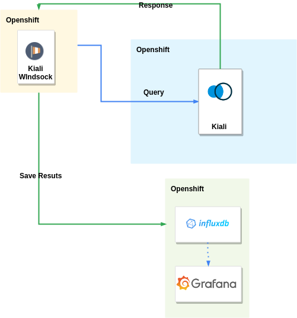
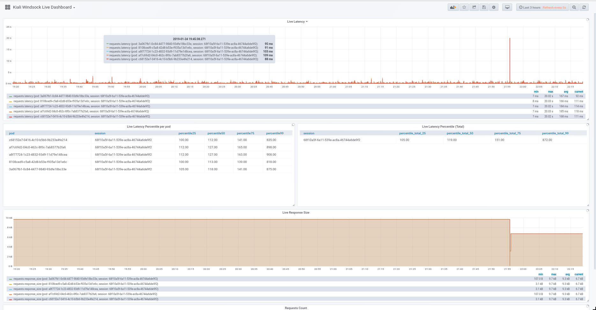

# Kiali REST API Perfomance Testing Framework -  Kiali Windsock
Windsock is a tool used to measure wind speed and direction (https://en.wikipedia.org/wiki/Windsock).

Kili Windsock is Performance Test Framework inspired by Fortio (https://github.com/fortio/fortio) and RegPatrol (https://ibmcloud-perf.istio.io/regpatrol/).

## Componentes of Kiali Anometer

- Kiali Scale Mesh 

- Kiali Python Client

- Kiali Ansible Module (embedded)

- Kiali Windsock (Kiali Traffic Generator)

- InfluxDB Database (Required)

- Grafana Dashboard

## Structure Diagram

## Dashboard

## Deploying 

1. Deploy InfluxDB (Grab the Address for further use it)

2. Run ``make deploy performance test`` or `ansible-playbook -i performance_test.yaml` with external variables set.

>  -e kiali_hostname # Kiali Hostname
>  -e kiali_username # Kiali Username
>  -e kiali_password # Kiali Password
>  -e test_name # Test Name (it will be used to create namespace)
>  -e influx_address # Influx Address
>  -e influx_username # Influx Username
>  -e influx_password # Influx Password
>  -e rate # Rate of Requests (in seconds)
>  -e duration # Duration of Tests (in seconds)
>  -e number_of_users # Number of Users (Users)