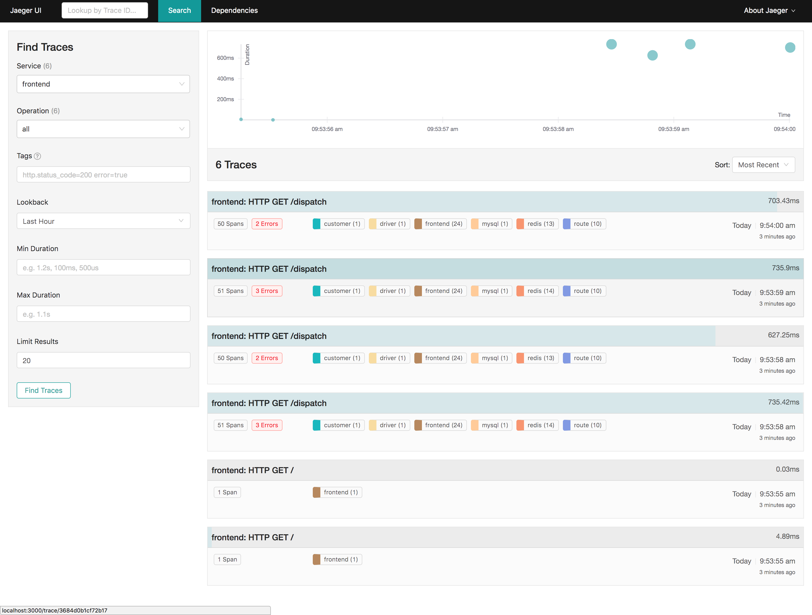
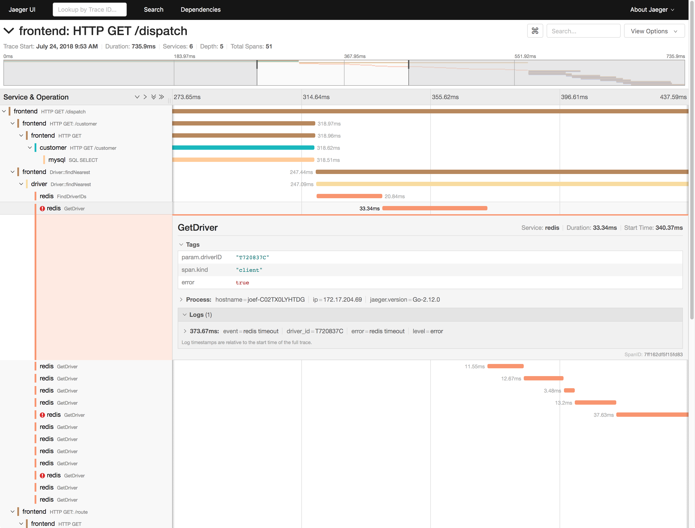

[![ReadTheDocs][doc-img]][doc] [![Build Status][ci-img]][ci] [![Coverage Status][cov-img]][cov] [![FOSSA Status][fossa-img]][fossa]

# Jaeger UI

Visualize distributed tracing with Jaeger.

|              Trace Search              |             Trace Details              |
| :------------------------------------: | :------------------------------------: |
|  |  |

## Contributing

See [CONTRIBUTING](./CONTRIBUTING.md).

## Development

The app was built with [create-react-app](https://github.com/facebookincubator/create-react-app).

### Running the application

Fork, then clone the `jaeger-ui` repo and change directory into it.

```
git clone https://github.com/jaegertracing/jaeger-ui.git
cd jaeger-ui
```

Use the recommended Node versions: (defined in [.nvmrc](./.nvmrc) file):

```
nvm use
```

Install dependencies via `yarn`:

```
yarn install
# or
yarn
```

Make sure you have the Jaeger Query service running on http://localhost:16686. For example, you can run Jaeger all-in-one Docker image as described in the [documentation][aio-docs].

If you don't have it running locally, then tunnel to the correct host and port.

```
ssh -fN -L 16686:$BACKEND_HOST:$BACKEND_PORT $BACKEND_HOST
```

If you are using [UI Base Path](https://www.jaegertracing.io/docs/1.7/deployment/#ui-base-path) feature, you need to append the base path into `proxy->/api->target` in package.json file. for example: if the base path is `"/jaeger"`, then the target should be `"http://localhost:16686/jaeger"`

Start the development server with hot loading:

```
yarn start
```

#### Commands

| Command      | Description                                                         |
| ------------ | ------------------------------------------------------------------- |
| `yarn start` | Starts development server with hot reloading and api proxy.         |
| `yarn test`  | Run all the tests                                                   |
| `yarn lint`  | Lint the project (eslint, prettier, typescript)                     |
| `yarn build` | Runs production build. Outputs files to `packages/jaeger-ui/build`. |

## Build

Running build will output all the static files to the `packages/jaeger-ui/build` folder:

```
yarn install
yarn build
```

## UI Configuration

See the [deployment guide](https://www.jaegertracing.io/docs/latest/deployment/#ui-configuration) for details on configuring Google Analytics tracking and menu customizations.

## License

[Apache 2.0 License](./LICENSE).

[doc-img]: https://readthedocs.org/projects/jaeger/badge/?version=latest
[doc]: https://www.jaegertracing.io/docs/latest/
[ci-img]: https://travis-ci.org/jaegertracing/jaeger-ui.svg?branch=master
[ci]: https://travis-ci.org/jaegertracing/jaeger-ui
[cov-img]: https://codecov.io/gh/jaegertracing/jaeger-ui/branch/master/graph/badge.svg
[cov]: https://codecov.io/gh/jaegertracing/jaeger-ui
[aio-docs]: https://www.jaegertracing.io/docs/latest/getting-started/
[fossa-img]: https://app.fossa.io/api/projects/git%2Bgithub.com%2Fjaegertracing%2Fjaeger-ui.svg?type=shield
[fossa]: https://app.fossa.io/projects/git%2Bgithub.com%2Fjaegertracing%2Fjaeger-ui?ref=badge_shield
